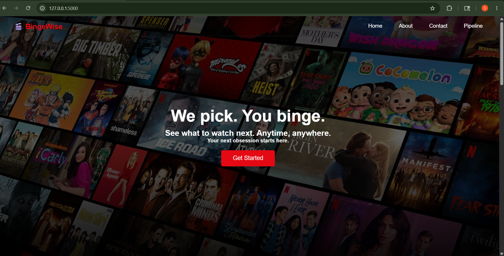
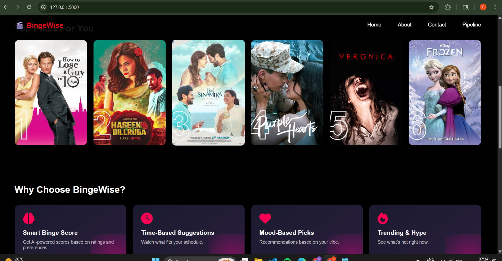
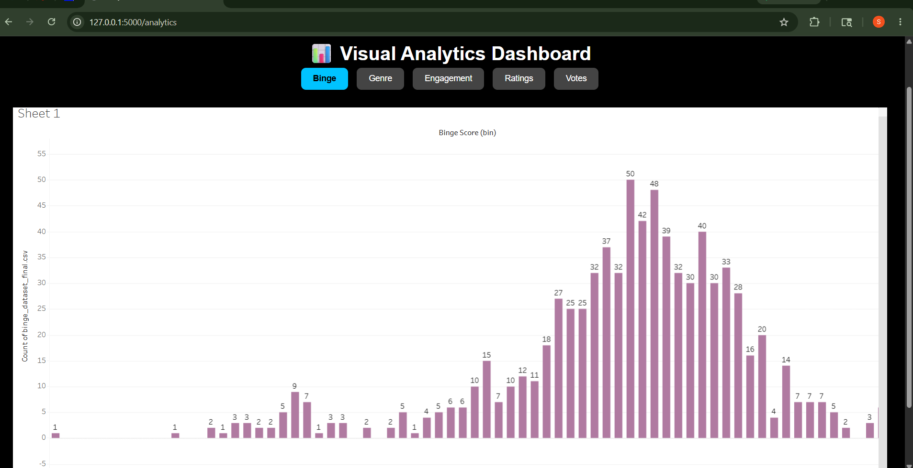
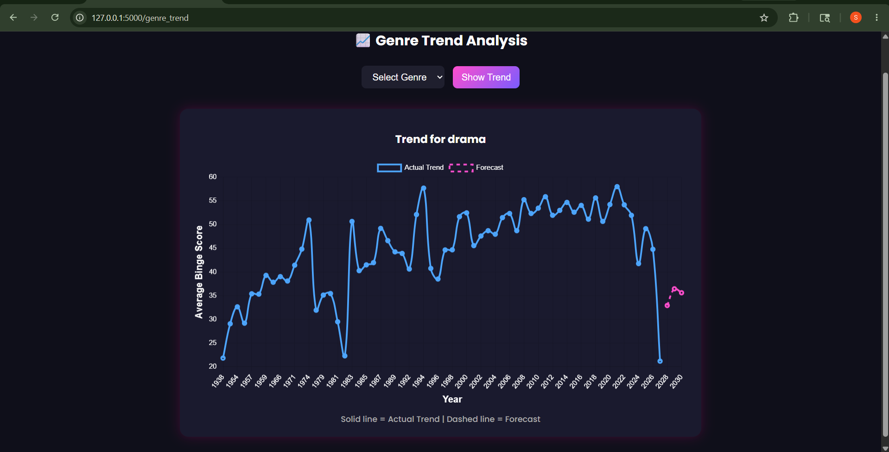
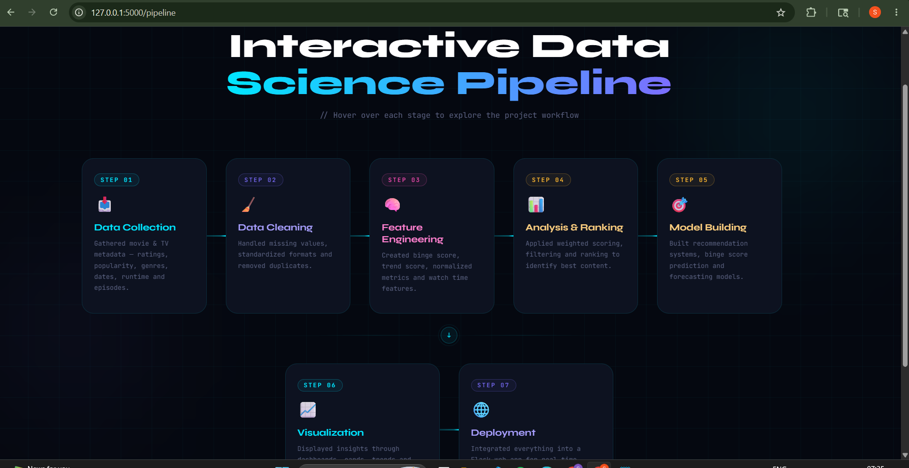
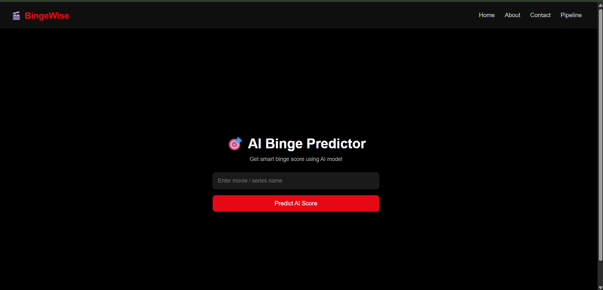
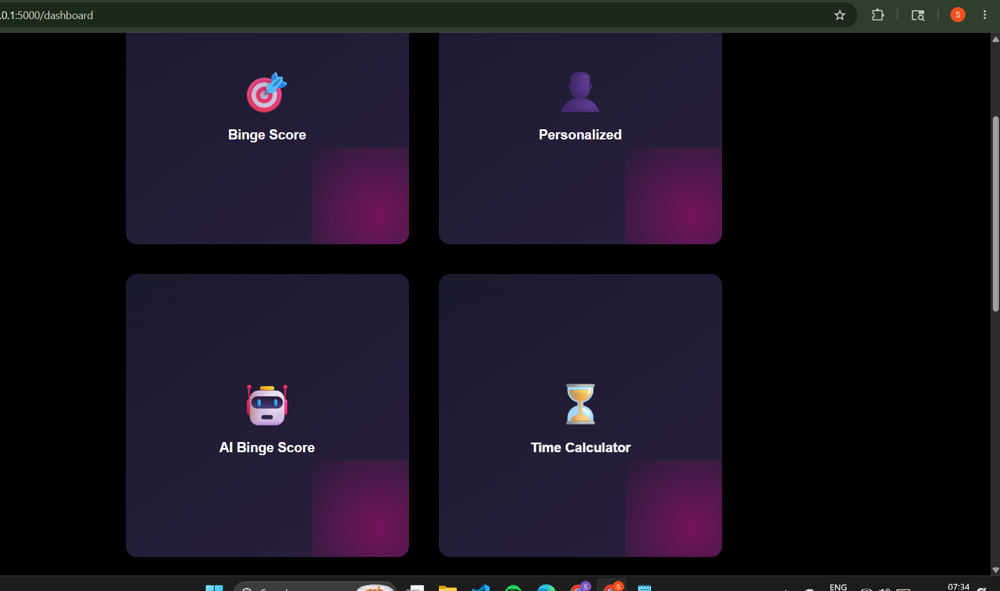
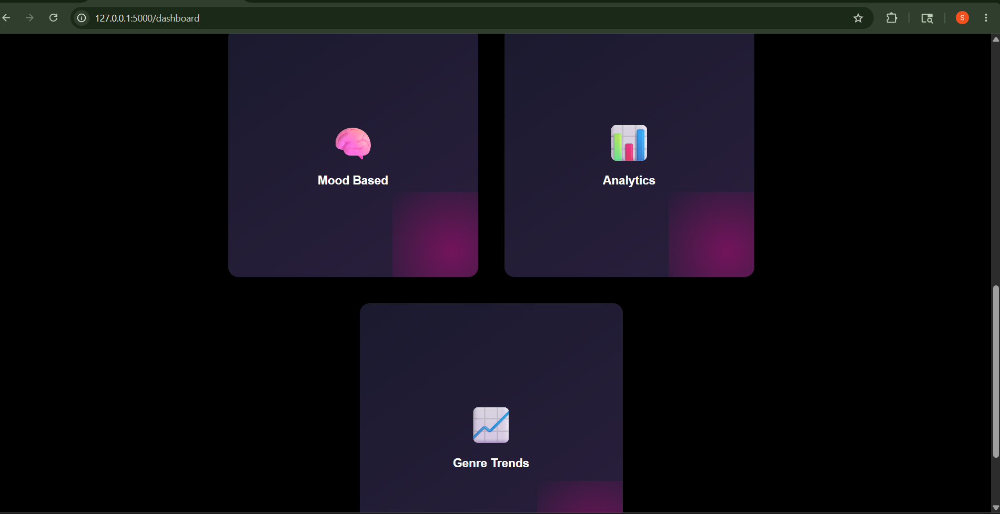
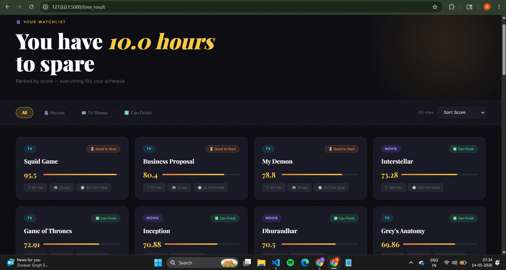

# 🎬 Binge Worthiness Website – Movie Genre Trend Analysis & Forecasting

A Data Science and Analytics project that analyzes movie genre trends over the years and predicts future popularity using Machine Learning and Time Series Forecasting techniques.  
The project also includes interactive visualizations and dashboards for better trend understanding.

---

# 📌 Project Overview

Binge Worthiness Website is a movie analytics platform developed to study how movie genres perform over time.  
The system performs:

- Data collection and preprocessing
- Exploratory Data Analysis (EDA)
- Genre popularity analysis
- Trend visualization
- Future trend forecasting using ARIMA and Linear Regression
- Dashboard creation using Power BI

The goal of the project is to help understand audience preferences and predict upcoming entertainment trends.

---

# 🚀 Features

- 📊 Movie genre trend analysis
- 📈 Future popularity forecasting
- 🧹 Data cleaning & preprocessing
- 🔍 Exploratory Data Analysis (EDA)
- 🤖 Machine Learning model building
- 📉 Time Series Forecasting using ARIMA
- 📊 Interactive Power BI dashboard
- 🌐 Web interface for genre trend visualization

---

# 🛠️ Tech Stack

## Programming & Libraries
- Python
- Pandas
- NumPy
- Matplotlib
- Scikit-learn
- Statsmodels
- Flask

## Visualization
- Power BI

## Machine Learning Models
- Linear Regression
- ARIMA (2,0,2)

---

# 📂 Dataset

The dataset contains movie-related information such as:

- Movie titles
- Genres
- Release years
- Ratings
- Popularity metrics

Data preprocessing included:
- Handling missing values
- Removing duplicates
- Genre extraction
- Feature engineering
- Year-wise aggregation

---

# ⚙️ Project Workflow

## 1️⃣ Data Collection
Collected movie dataset containing genre and popularity information.

## 2️⃣ Data Preprocessing
Performed:
- Null value handling
- Data cleaning
- Genre separation
- Formatting and transformation

## 3️⃣ Exploratory Data Analysis
Analyzed:
- Most popular genres
- Year-wise genre growth
- Genre comparison trends
- Rating distributions

## 4️⃣ Model Building

### 🔹 Linear Regression
Used for identifying overall trend growth patterns.

### 🔹 ARIMA Time Series Forecasting
Used to forecast future genre popularity based on historical trends.

---

# 📊 Model Evaluation

The models were evaluated using:

- RMSE (Root Mean Square Error)
- R² Score

These metrics helped evaluate prediction accuracy and model performance.

---

# 📈 Forecasting Output

The system predicts:
- Future genre trends
- Popularity growth/decline
- Year-wise trend movement

Example:
- Thriller genre expected growth
- Comedy trend comparison
- Action movie popularity forecasting

---

# 🌐 Web Application

The Flask-based web application allows users to:

- Enter a movie genre
- View historical trend analysis
- Visualize future predictions
- Display graphs dynamically

---

# 📊 Power BI Dashboard

The Power BI dashboard includes:
- Genre-wise popularity charts
- Year-wise trend analysis
- Interactive filters
- Forecast visualizations
- KPI summaries

---

# 📁 Project Structure

```bash
BingeIQ/
│
├── dataset/
├── notebooks/
├── models/
├── templates/
├── static/
├── app.py
├── requirements.txt
├── README.md
└── powerbi_dashboard.pbix
```

---

# ▶️ How to Run the Project

## 1️⃣ Clone the Repository

```bash
git clone https://github.com/sanyogita-c05/binge-worthiness-website
cd binge-worthiness-webiste/backend
```

## 2️⃣ Install Dependencies

```bash
pip install -r requirements.txt
```

## 3️⃣ Run the Flask App

```bash
python app.py
```

## 4️⃣ Open in Browser

```bash
http://127.0.0.1:5000
```

---
## 📷 Screenshots

### Dashboard 1




### Visualization


### Trend Prediction


### Pipeline


## Binge Score



## Features 




## Time Calculation


---

# 🔮 Future Scope

- Recommendation system integration
- Deep Learning forecasting models
- Sentiment analysis using reviews
- Real-time OTT platform analytics
- User personalization features

---

